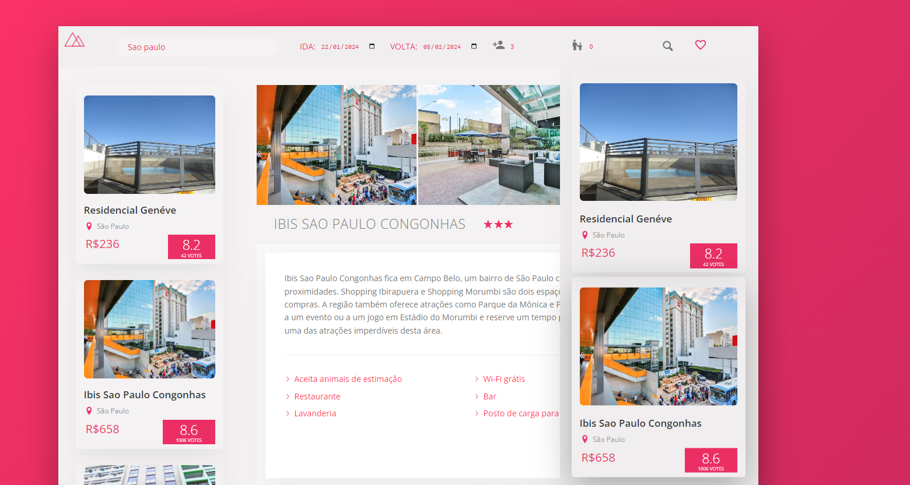

<h1 align="center">Trillo Hotel</h1>

<h2> Bem vindo ao <a href=" https://hotelstrillo.netlify.app/">Trillo Hotel</a>.</h2>

 Um site onde você consegue fazer buscas por hóteis de todo país, salvar nos seus favoritos e ver quantos quartos ainda estão disponíves no hotel.

<h2> 🔨 Funcionalidade do projeto</h2>

- `Funcionalidade 1`: Você pode passar os dados de entrada nos belos inputs que estão visíveis assim que você adentra o site, com o primeiro espaço destinado a receber o <strong>nome da cidade</strong>, o segundo com a <strong>data de Ida</strong> e o segundo com <strong> data de Volta</strong>, quantos <strong> adultos</strong> irão e a entrada para a idade das <strong>crianças</strong>.
- `Funcionalidade 1a`: A entrada para as CRINÇAS é feita por idade e a quantidade é separada por vírgula. ex: 10 (anos), 5 (anos).

- `Funcionalidade 2`: Caso você goste de algum hotel você é livre para salvá-lo na sua lista de favoritos, caso enjoe também é possível removê-lo a hora que quiser.

<h2>✔️ Tecnologias utilizadas</h2>

- `HTML`: Utilizado para criar a estrutura do site.

- `SASS`: Utilizado para a estilização do site.

- `Vanilla JavaScript`: Utilizado para as interações no site. Utilizando 100% do JavaScript sem nenhum tipo de framework.

<h3>Link para o site</h3>

- 
Você pode acessar o deploy do site <a href=" https://hotelstrillo.netlify.app/">clicando aqui</a>.

